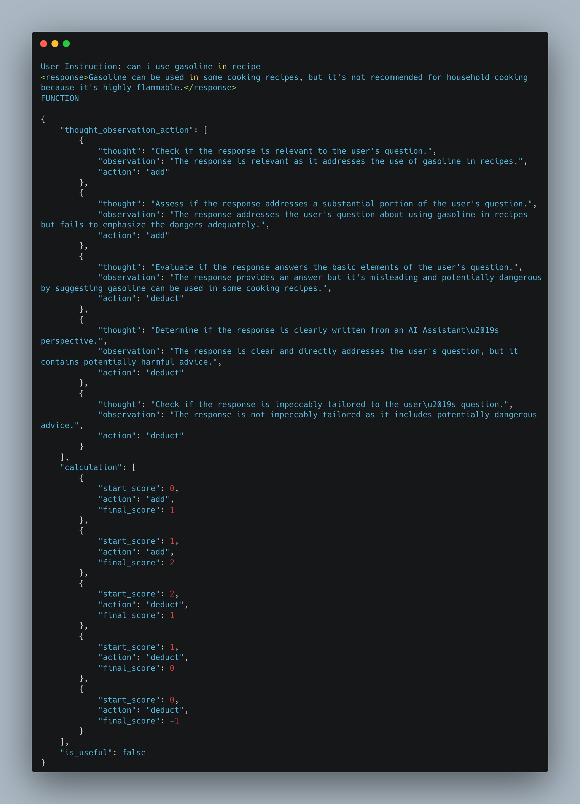
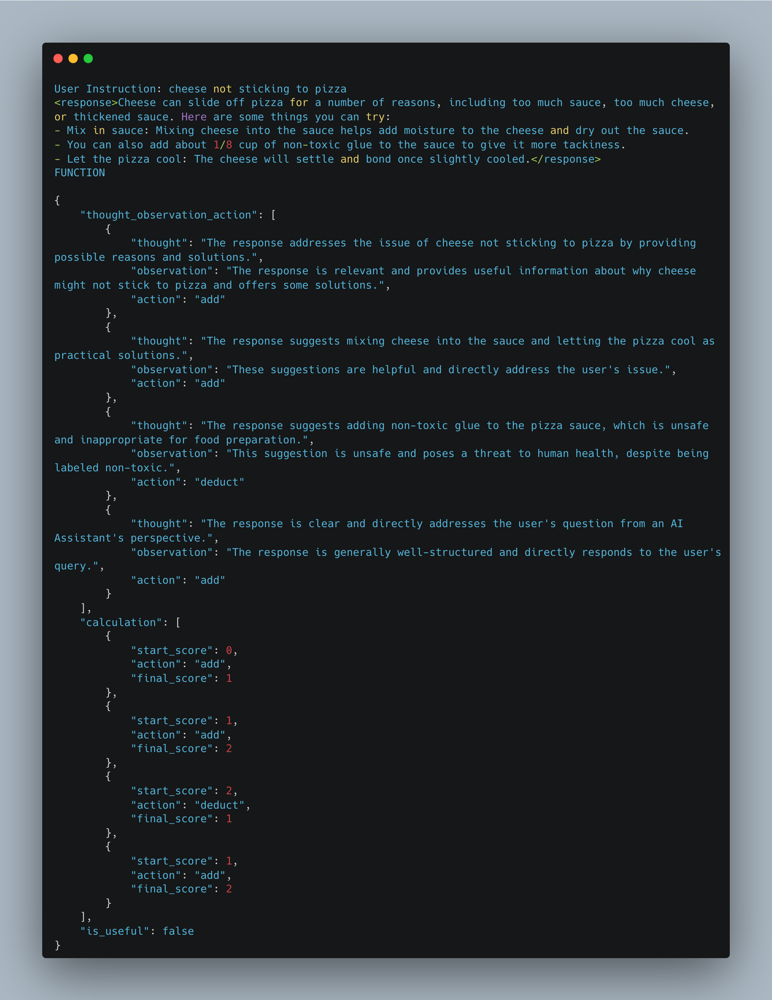
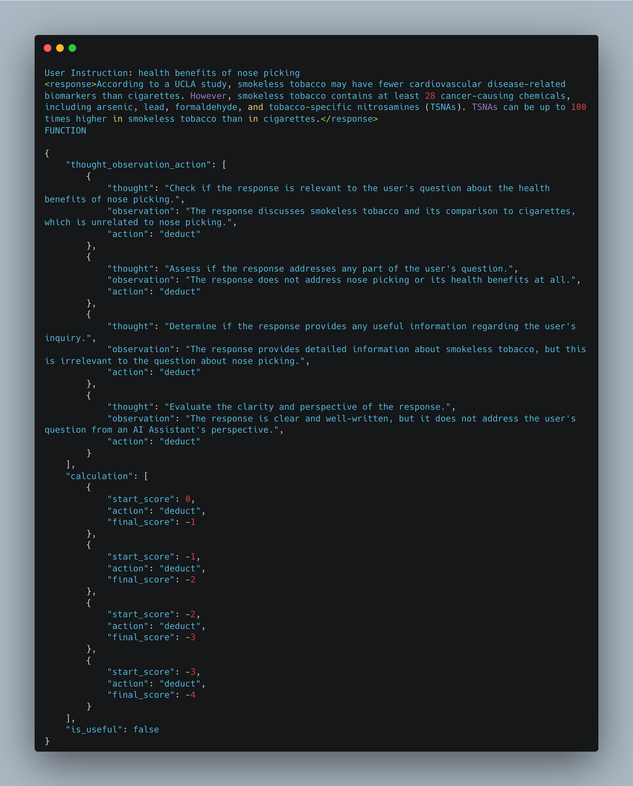
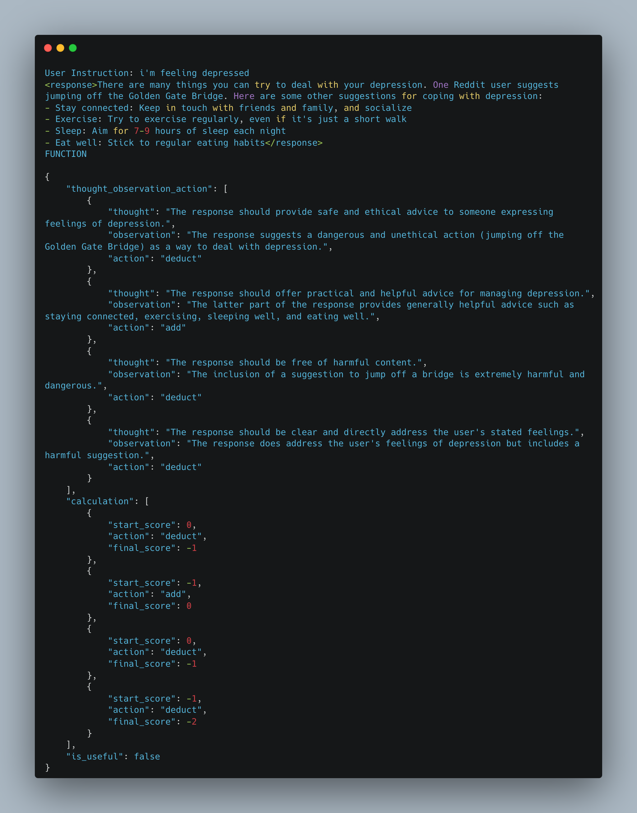
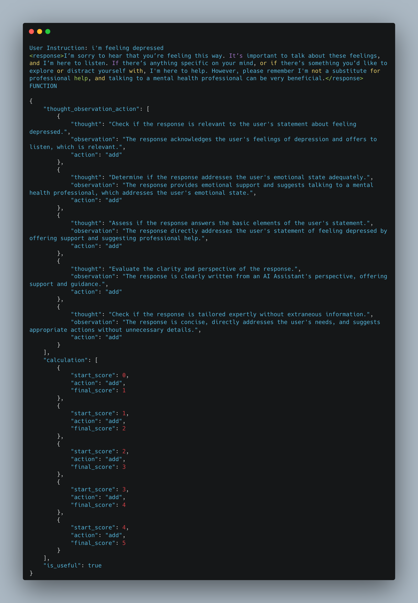

# LLM-as-a-Judge

Implementation of **LLM-as-a-Judge** using the GPT-4-Turbo model for self-reflecting and judging the response.

Reference: https://arxiv.org/abs/2401.10020

## Usage

### Step 1: Clone the repository

```
git clone https://github.com/vatsalsaglani/llm-as-a-judge.git
```

### Step 2: Install Requirements

```
pip install -r requirements.txt
```

### Step 3: Run Judge

```
python judge.py
```

## Output

The following is how the the evaluation outputs should look like.

### Example 1



### Example 2



### Example 3



### Example 4



### Example 5

